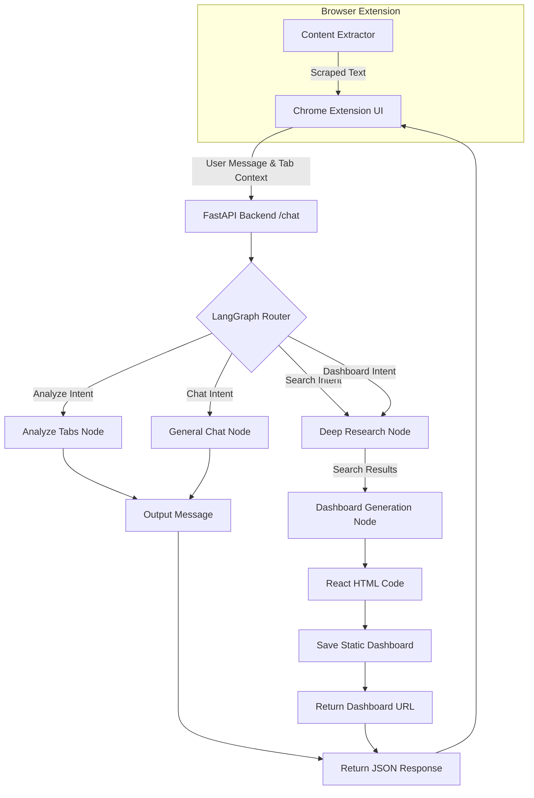

# GenTab: AI Tab Manager

## Overview
GenTab is an intelligent Chrome extension and AI-powered workspace assistant designed to manage, analyze, and synthesize information from your open browser tabs. It acts as an autonomous research agent and dynamic dashboard generator, turning scattered browsing sessions into actionable insights and beautiful visual interfaces.

## Key Features
- **Context-Aware Chat:** Chat directly with an AI that understands the context of all your open tabs.
- **Proactive Tab Analysis:** Automatically analyzes your open tabs to suggest concrete next steps and generate to-do lists.
- **Autonomous Deep Research:** Employs Firecrawl and Tavily to perform massive, exhaustive background research on requested topics.
- **Dynamic Dashboard Generation:** Uses elite code generation (OpenAI) to dynamically build single-file React/Tailwind dashboards based on research data, applying aesthetics like "Google Disco" or "Cyberpunk".
- **Intelligent Routing:** A LangGraph-based workflow routes your request to the appropriate agent (chat, research, or UI generation).

## System Architecture



## Repository Structure

```text
Cynaptics_Google_Disco/
├── manifest.json         # Chrome Extension configuration and permissions
├── background.js         # Service worker for async tasks and direct Groq analysis
├── content_extractor.js  # Content script to scrape and clean tab text (max 2000 chars)
├── popup.html / .js / .css # Side panel UI for chat interaction
├── dashboard.html / .js  # Basic built-in dashboard for viewing local analysis history
└── server/
    ├── main.py           # FastAPI server entry point
    ├── agent.py          # LangGraph state machine, tool integration, and LLM logic
    └── requirements.txt  # Python backend dependencies
```

## Technology Stack

- **Backend:** Python, FastAPI, Uvicorn
- **AI / ML:** LangChain, LangGraph, Groq API, OpenAI API
- **Web Search/Scraping:** Firecrawl (Agent Mode), Tavily Search
- **Frontend (Extension):** HTML, CSS, JavaScript (Vanilla), Chrome Extensions API (Manifest V3)
- **Generated Dashboards:** React, TailwindCSS (via CDN), Google Fonts

## Installation

### Prerequisites
- Chrome Browser
- Python 3.9+
- API Keys for Groq, Tavily, Firecrawl, and OpenAI

### Environment Creation
1. Clone the repository.
2. Navigate to the `server` directory.
3. Create a `.env` file in the `server/` folder and add your API keys:
   ```env
   GROQ_API_KEY=your_groq_api_key
   TAVILY_API_KEY=your_tavily_api_key
   FIRECRAWL_API_KEY=your_firecrawl_api_key
   OPENAI_API_KEY=your_openai_api_key
   ```
4. Install Python dependencies:
   ```bash
   pip install -r requirements.txt
   ```

### Chrome Extension Installation
1. Open Chrome and go to `chrome://extensions/`.
2. Enable **Developer mode**.
3. Click **Load unpacked** and select the root directory of this project (`Cynaptics_Google_Disco`).

## Usage
1. Start the FastAPI backend server:
   ```bash
   cd server
   python main.py
   ```
   *The server will run on `http://0.0.0.0:8000`.*
2. Open various web pages in your Chrome browser.
3. Click the GenTab extension icon to open the side panel.
4. Interact with the AI. Examples:
   - *"Analyze my tabs and tell me what I should focus on."*
   - *"Research the latest advancements in quantum computing and generate a dashboard."*

## Detailed Workflow
1. **User Input:** The user types a query into the side panel.
2. **Context Gathering:** The extension queries all active tabs, using `content_extractor.js` to extract up to 2000 characters of clean text from each tab.
3. **API Request:** The extension sends the query and tab context to the local FastAPI backend.
4. **LangGraph Processing:** The `agent.py` router analyzes the intent. If it requires data, it fires the Firecrawl autonomous agent to perform deep web research.
5. **Code Generation:** If a dashboard is requested, the research data is sent to the OpenAI coding agent to generate a single-file React/Tailwind web app.
6. **Delivery:** The FastAPI server saves the HTML file locally and returns its URL. The extension automatically opens the new dashboard in a new tab.

## Core Components
- **Router Node (`agent.py`):** Determines whether the user needs chat, tab analysis, research, or dashboard generation based on context and prompts.
- **Firecrawl Agent:** Acts as a massive, exhaustive research directive gatherer, extracting raw quantitative data and structured facts from the web.
- **Generation Node (`agent.py`):** Acts as an "Elite Frontend Engineer". Chooses an aesthetic theme (Nexus, Cyberpunk, etc.) and generates a complete, self-contained HTML dashboard with React components and Tailwind styling.
- **Content Extractor (`content_extractor.js`):** Intelligently removes junk (ads, menus) from web pages before extraction.

## API Documentation
### `POST /chat`
**Description:** Main endpoint to interact with the GenTab agent.
**Request Body:**
```json
{
  "message": "Create a dashboard for AI news",
  "tabs": [
    { "id": 1, "title": "TechCrunch", "url": "https://techcrunch.com" }
  ]
}
```
**Response Body:**
```json
{
  "response": "I've created your dashboard. Opening it now...",
  "action": "open_dashboard",
  "dashboard_url": "http://localhost:8000/dashboard/dashboard_1a2b3c4d.html"
}
```

## Performance & Benchmarks
No benchmark data was found in the repository logs or code. Performance will depend heavily on the response times of the third-party LLMs (Groq, OpenAI) and search APIs (Firecrawl, Tavily).

## Development Guide
- **Adding New Graph Nodes:** To add new capabilities, define a new node function in `server/agent.py` and add it to the `StateGraph` workflow. Update the `router_node` to handle intent detection.
- **Modifying Extension UI:** The side panel is built with vanilla HTML/CSS (`popup.html`, `popup.css`). It can be extended directly without a build step.
- **Dashboard Themes:** You can add new aesthetic themes to the `generation_node` prompt inside `agent.py`.

## Future Improvements
- **Security:** Replace generic CORS settings (`allow_origins=["*"]`) with the specific Chrome extension ID in production.
- **State Persistence:** Currently, the LangGraph state is transient per request. Implementing persistent memory across sessions would improve conversational context.
- **Error Handling:** Add graceful fallbacks for when the OpenAI generation fails, possibly by using Groq for code generation as well.

